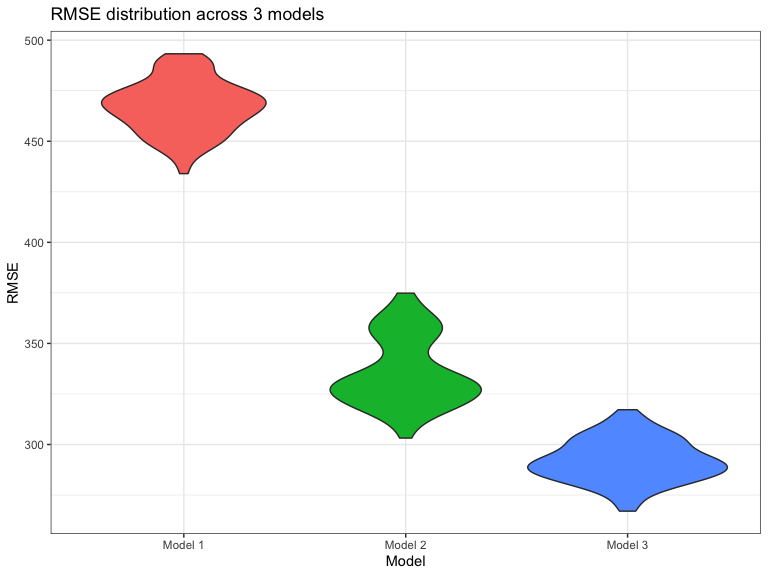

p8105\_hw6\_jys2136
================
Jocelyn Sun
12/3/2021

### Problem 1

#### Importing birthweight data

``` r
bwt_df = 
  read_csv("./data/birthweight.csv") %>%
  janitor::clean_names() %>%
   mutate(
    babysex = as.factor(babysex),
    frace = as.factor(frace),
    mrace = as.factor(mrace),
    malform = as.factor(malform)
  )

#checking for missing data
sapply(bwt_df, function(x) sum(is.na(x)))
```

    ##  babysex    bhead  blength      bwt    delwt  fincome    frace  gaweeks 
    ##        0        0        0        0        0        0        0        0 
    ##  malform menarche  mheight   momage    mrace   parity  pnumlbw  pnumsga 
    ##        0        0        0        0        0        0        0        0 
    ##    ppbmi     ppwt   smoken   wtgain 
    ##        0        0        0        0

There are no missing values in this data set as seen in the output.

#### Building a model

There are multiple mechanisms–biological, social, and economical–that
influence birth outcomes. Low birthweight is a major predictor of
prenatal mortality and comorbid with noncommunicable diseases, such as
diabetes, later in life
[(1)](https://bmcresnotes.biomedcentral.com/articles/10.1186/s13104-019-4155-x).
The World Health Organization (WHO) defines low birthweight as weight at
birth below 2500g or 5.5lbs. Globally, it is estimated that 15 - 20% of
all births are low birthweights
[(2)](https://apps.who.int/nutrition/publications/globaltargets2025_policybrief_lbw/en/index.html).

Maternal nutrition is highly associated with birth outcomes
[(2)](https://apps.who.int/nutrition/publications/globaltargets2025_policybrief_lbw/en/index.html).
Furthermore, maternal nutrition is also associated with gestational
weight gain
[(3)](https://bmcpregnancychildbirth.biomedcentral.com/articles/10.1186/s12884-019-2643-6).
Therefore, we propose a model where maternal weight gain during
pregnancy is a primary predictor of low birthweight, adjusting for
mother’s height, mother’s age at delivery, mother’s race, and family
income.

**Model 1:** bwt \~ wtgain + mheight + momage + mrace + fincome

``` r
wt_model = lm(bwt ~ wtgain + mheight + momage + mrace + fincome, data = bwt_df)

wt_model %>% 
  broom::tidy() %>%
  select(term, estimate, p.value) %>% 
  knitr::kable(digits = 3)
```

| term        | estimate | p.value |
|:------------|---------:|--------:|
| (Intercept) |  972.071 |   0.000 |
| wtgain      |   11.288 |   0.000 |
| mheight     |   29.595 |   0.000 |
| momage      |    5.818 |   0.004 |
| mrace2      | -272.341 |   0.000 |
| mrace3      |  -88.968 |   0.219 |
| mrace4      |  -92.090 |   0.005 |
| fincome     |    0.491 |   0.107 |

``` r
bwt_df %>%
  modelr::add_predictions(wt_model, var = "pred") %>%
  modelr::add_residuals(wt_model, var = "resid") %>%
  ggplot(aes(x = pred, y = resid)) +
  geom_point(alpha = 0.2) +
  geom_smooth(se = FALSE, method = "lm", color = "red") +
  labs(
    x = "Predicted values",
    y = "Residuals",
    title = "Residuals vs. predicted values",
    caption = "Regression diagnostics"
  )
```


As we can see from the distribution of residuals, there is no clear
trend and tend to cluster around the center of the plot. The residuals
are also rather symmetrically distributed around 0. We can conclude that
the residuals are rather randomly distributed, and this may be a good
model to consider using.

#### Model Comparisons

Comparing Model 1 with two others:

-   One using length at birth and gestational age as predictors (main
    effects only)  
-   One using head circumference, length, sex, and all interactions
    (including the three-way interaction) between these

**Model 2:** bwt \~ blength + gaweeks

**Model 3:** bwt \~ babysex + blength + bhead + babysex \* blength +
babysex \* bhead + blength \* bhead + babysex \* blength \* bhead

``` r
cv_df =
  crossv_mc(bwt_df, 100) %>% 
  mutate(train = map(train, as_tibble),
         test = map(test, as_tibble))

cv_df = 
  cv_df  %>% 
  mutate(
    m1 = map(train, ~lm(bwt ~ wtgain + mheight + momage + mrace + fincome, data = .x)),
    m2 = map(train, ~lm(bwt ~ blength + gaweeks,  data = .x)),
    m3 = map(train, ~lm(bwt ~ babysex + blength + bhead + babysex * blength + babysex * bhead + blength * bhead + babysex * blength * bhead, data = .x))
    ) %>% 
  mutate(
    rmse_m1 = map2_dbl(m1, test, ~rmse(model = .x, data = .y)),
    rmse_m2 = map2_dbl(m2, test, ~rmse(model = .x, data = .y)),
    rmse_m3 = map2_dbl(m3, test, ~rmse(model = .x, data = .y)))

cv_df %>% 
  select(starts_with("rmse")) %>% 
  pivot_longer(
    everything(),
    names_to = "model", 
    values_to = "rmse",
    names_prefix = "rmse_") %>% 
  mutate(model = fct_inorder(model)) %>% 
  ggplot(aes(x = model, y = rmse)) +
  geom_violin(aes(fill = model)) +
  labs(
    x = "Model",
    y = "RMSE",
    title = "RMSE distribution across 3 models"
  ) +
  scale_x_discrete(labels = c(
    "m1" = "Model 1", 
    "m2" = "Model 2",
    "m3" = "Model 3")) +
  theme(legend.position = "none")
```



From the RMSE plot above, **Model 3**, having the loswet RMSE, appears
to be the best model. Therefore, the best predictors to use are **head
circumference, length, sex, and all interactions, including a three way
interaction** to predict baby’s birthweight.

### Problem 2

#### Importing weather data

``` r
weather_df = 
  rnoaa::meteo_pull_monitors(
    c("USW00094728"),
    var = c("PRCP", "TMIN", "TMAX"), 
    date_min = "2017-01-01",
    date_max = "2017-12-31") %>%
  mutate(
    name = recode(id, USW00094728 = "CentralPark_NY"),
    tmin = tmin / 10,
    tmax = tmax / 10) %>%
  select(name, id, everything())
```
